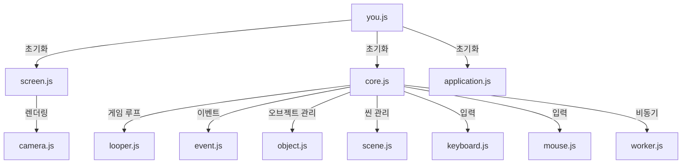

# npc

## 프레임워크

이 프레임워크는 웹 기반 게임 개발을 위해 설계된 모듈형 구조를 가지고 있습니다. 각 파일은 게임의 핵심 기능을 담당하며, 확장성과 유지보수성을 고려하여 분리되어 있습니다.

### 폴더 구조

```
app/scripts/framework/
├── application.js   # 게임 애플리케이션의 진입점 및 전체 관리
├── camera.js        # 카메라 및 뷰포트 관리
├── core.js          # 게임 루프 및 핵심 엔진 기능
├── event.js         # 이벤트 처리 및 관리
├── keyboard.js      # 키보드 입력 처리
├── looper.js        # 반복 및 타이밍 제어
├── mouse.js         # 마우스 입력 처리
├── object.js        # 게임 오브젝트의 기본 클래스 및 관리
├── scene.js         # 씬(장면) 관리 및 전환
├── screen.js        # 화면 및 캔버스 관리
├── worker.js        # 비동기 작업 및 워커 관리
├── you.js           # 프레임워크 초기화 및 글로벌 등록
```

### 주요 파일 설명

#### application.js
- 게임 애플리케이션의 진입점 역할을 하며, 전체 게임의 흐름을 관리합니다.

#### camera.js
- 게임 내 카메라의 위치, 이동, 확대/축소 등 뷰포트 관련 기능을 제공합니다.

#### core.js
- 게임 루프(업데이트/렌더링)와 엔진의 핵심 기능을 담당합니다.

#### event.js
- 사용자 입력 및 시스템 이벤트를 처리하고, 이벤트 리스너를 관리합니다.

#### keyboard.js / mouse.js
- 키보드와 마우스 입력을 감지하고, 게임 내에서 사용할 수 있도록 이벤트를 제공합니다.

#### looper.js
- 반복 작업, 타이머, 애니메이션 프레임 관리 등 시간 제어 기능을 담당합니다.

#### object.js
- 게임 내 모든 오브젝트의 기본 클래스 및 공통 기능을 정의합니다.

#### scene.js
- 여러 씬(장면)을 관리하며, 씬 간의 전환 및 상태 관리를 담당합니다.

#### screen.js
- 캔버스 및 화면 렌더링을 관리하며, 해상도 및 화면 크기 조절 기능을 제공합니다.

#### worker.js
- 웹 워커를 활용한 비동기 작업 처리 및 성능 향상에 기여합니다.

#### you.js
- 프레임워크의 초기화 함수(`start`)를 제공하며, 주요 객체를 글로벌로 등록하여 접근성을 높입니다.

### 프레임워크 구조 다이어그램 (Mermaid)



### 프레임워크의 특징
- **모듈화**: 각 기능별로 파일이 분리되어 있어 유지보수와 확장이 용이함
- **입력 처리**: 키보드와 마우스 등 다양한 입력을 지원
- **씬/오브젝트 관리**: 게임 내 여러 장면과 오브젝트를 효율적으로 관리
- **비동기 처리**: 워커를 통한 비동기 작업 지원으로 성능 최적화
- **글로벌 접근성**: 주요 객체를 글로벌로 등록하여 테스트 및 디버깅이 편리함

### 예시: 프레임워크 초기화
```javascript
you.start({
    screen: { ... },
    application: MyGameApp,
    registerInGlobal: true
});
```

---
이 프레임워크는 웹 게임 개발에 필요한 핵심 기능을 직접 구현하여, 다양한 게임에 적용할 수 있도록 설계되었습니다. 각 모듈의 역할과 구조를 이해하면, 새로운 기능 추가 및 커스터마이징이 용이합니다.

## 게임 목표

N(30/50/100)일이 지나면 마왕이 부활한다는 예언이 있다. 그 안에 용사를 성장시켜 마왕을 쓰러뜨려라!

## 게임 플레이

### 상점 주인(플레이어)

#### 필드
필드에 떨어진 아이템을 수집함
거의 기본 재료 아이템만 수집할 수 있어서 초반에 주로 이용함

필드 장면으로 이동해서 필드 맵을 생성함
필드에 생성할 아이템들을 가져옴
필드 오브젝트를 생성해서 화면에 보여줌
필드 오브젝트는 클릭하면 획득할 수 있음
필드에 몬스터를 생성해서 필드 오브젝트를 없애서 방해함
몬스터를 클릭하면 몬스터의 체력이 닳고 0이 되면 일정 시간동안 기절함

#### 제작
아이템 제작대에 재료를 올려놓고 아이템 제작함
크기가 제일 작은 *기본 제작대*를 가지고 있음
재료를 가지고 있으면 업그레이드가 가능함
제작대의 격자에 재료 아이템을 배치하면 아이템을 제작할 수 있음
적절한 배치를 찾아 더 좋은 퀄리티의 아이템을 제작할 수 있음
레시피와 50%이상 차이가 나면 제작에 실패함
+아이템 레시피 제작

아이템 제작 아이콘을 누르면 아이템 제작대와 인벤토리를 보여줌
인벤토리에서 아이템을 선택해서 제작대에 배치할 수 있음
아이템을 제작대에 적절히 올려두어 제작 버튼을 누르면 제작 시도를 할 수 있음
아이템 선택한 후 제작대에서 왼쪽 클릭하면 배치할 수 있음
오른쪽 클릭하면 배치를 취소할 수 있음
ESC를 누르면 제작대가 초기화됨
적절한 레시피대로 배치해두었다면 아이템이 만들어지고,
일정 개수 이상이 틀리다면 제작에 실패함

#### 판매
제작된 아이템을 판매함
용사가 찾아와서 아이템을 요구함
플레이어는 적절한 가격을 제시해서 거래해야함
너무 싸면 플레이어가 돈이 없어짐
너무 비싸면 용사가 아이템을 얻지 못하고 성장하지 못함

처음엔 용사를 기다린다는 메세지를 보여줌
랜덤하게 용사가 나타나면 큐에 채워넣음
용사를 클릭하면 어떤 아이템을 요구하는지 볼 수 있고 얼마에 판매할지 입력할 수 있음
입력이 끝나면 아이템을 전달하고 돈을 받음
+용사가 장비하는 것과 스탯 변화를 보여줌
다음 용사를 보여주고 반복함

##### 아이템의 가격
아이템의 제작 재료를 얼마나 잘 구할 수 있느냐에 따라 가격이 결정됨
재료 아이템을 드랍하는 몬스터가 많으면 가격이 떨어짐
몬스터를 잡기 어려울수록 가격이 올라감

몬스터 잡는 시간 = 몬스터의 체력 / max(0, 용사의 평균 공격력 - 몬스터의 방어력)
용사가 죽는 시간 = 용사의 체력 / max(0, 몬스터의 공격력 - 용사의 방어력)
드랍 아이템당 얻는 데 걸리는 시간 = k * 몬스터 잡는 시간 / 평균 드랍 아이템 수
몬스터 잡는데 필요한 물약 가격 = max(0, 몬스터 잡는 시간 - 용사가 죽는 시간) * 시간당 물약 회복량 / 개당 평균 회복량 * 물약 가격
가격 = 드랍 아이템당 얻는 데 걸리는 시간 + 몬스터 잡는데 필요한 물약 가격

#### 퀘스트
용사에게 퀘스트를 의뢰함
퀘스트를 요청해놓으면 용사 중 랜덤하게 선착순으로 의뢰를 승인함
아이템 수집 퀘스트/토벌 퀘스트 중에 골라서 보상을 적절히 줘야함

어떤 아이템을 얻고 싶은 지에 따라 아이템 수집 혹은 토벌 퀘스트를 발행함
퀘스트 발행 시 계약금을 지불해야함
퀘스트 완료 시 계약금은 다시 받을 수 있음
발행한 퀘스트의 수주가 일정 시간동안 안되면 사라짐

### 용사(NPC)

#### 모험
아이템이 갖춰지면 사냥하러 모험을 떠남
자신의 레벨에 맞는 적절한 몬스터를 찾아서 싸움
체력이 떨어지거나 퀘스트를 완료하거나 레벨이 올라서 아이템을 바꿔야할 때 마을로 돌아옴
+*용기*가 높으면 더 강한 몬스터와 싸울 확률이 올라감

용사가 모험을 떠나기 전 퀘스트를 확인하고 적절한 퀘스트가 있으면 수주 받음
모험을 떠날 때 수주한 퀘스트가 있다면 퀘스트를 먼저 수행함(몬스터 만나기/아이템 수집하기)
N초에 한번씩 랜덤하게 주사위를 던져서 몬스터 만나거나 아이템 수집을 시도함
퀘스트가 없으면 자신과 맞는 레벨의 몬스터를 사냥하러 다님

#### 전투
몬스터를 만나면 전투를 시뮬레이션함
서로 공격을 주고 받음
확률적으로 회피하기도 하고 치명타도 발생해서 랜덤성이 발생함
이기면 아이템을 획득하고 경험치를 획득함
지면 아이템을 떨어뜨리고 레벨이 감소하거나 낮은 확률로 아예 사라질 수도 있음

용사와 싸울 몬스터를 생성함
용사의 행동력과 몬스터의 행동력을 업데이트해서 공격함
체력이 없으면 물약을 자동으로 사용함
이기면 몬스터에 따라 가지고 있을 수 있는 아이템을 확률에 의거해 생성하고 용사 인벤에 추가함
몬스터가 주는 경험치도 용사 경험치에 추가함
지면 용사 경험치를 깎고 스탯을 감소시킴
아이템을 일부 떨어뜨리고 돈도 떨어뜨림

## 게임 데이터

### 몬스터

- 슬라임
체력 3, 공격력 1, 방어력 0
아이템: 체리 0~2개
골드: 0~2
경험치: 2~3

- 고블린
체력 6, 공격력 2, 방어력 0
아이템: 돌 검 0~1개, 나무 방패 0~1개
골드: 0~5
경험치: 3~5


### 아이템

#### 장비 아이템

- 나무 검: 2의 공격력을 가짐
    = 목재 5개
- 나무 방패: 3의 방어력을 가짐
    = 목재 8개
- 돌 검: 5의 공격력을 가짐
    = 돌 5개
- 돌 방패: 6의 방어력을 가짐
    = 돌 8개
- 가죽 갑옷: 4의 방어력을 가짐
    = 가죽 8개
- 가죽 장화: 2의 방어력을 가짐
    = 가죽 6개

#### 소비 아이템

- 체리
    3의 체력을 회복함, 1원

- 체력 회복 물약(소/중/대)
    (10/30/100)의 체력을 회복함, (5/12/30)원
    = 체리 (2/3/5)개 + 허브 (1/3/5)개


#### 재료 아이템

- 허브
    몸에 좋음, 2원

#### 수집 아이템

- 보석류
    - 루비
    - 사파이어
    - 에메랄드

### 퀘스트

#### 수집 퀘스트

#### 토벌 퀘스트
